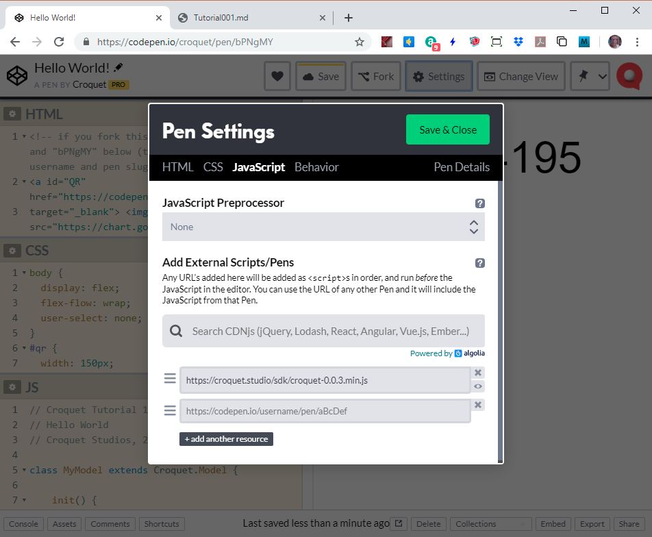

Copyright © 2019 Croquet Studios

We are using Codepen for our tutorials. That allows us to place a working example right in the tutorials for you to try out live. Codepen is extremely easy to use. You will certainly want to fork the tutorial code to try out your own ideas. Information for getting started is here:

{@link https://codepen.io/hello}

Below is the Croquet Hello World app running live in Codepen. Scroll through the code to the left. You will see that a simple Croquet app is indeed very simple.

<p class="codepen" data-height="437" data-theme-id="37149" data-default-tab="js,result" data-user="croquet" data-slug-hash="bPNgMY" style="height: 437px; box-sizing: border-box; display: flex; align-items: center; justify-content: center; border: 2px solid; margin: 1em 0; padding: 1em;" data-pen-title="Hello World!">
  <span>See the Pen <a href="https://codepen.io/croquet/pen/bPNgMY/">
  Hello World!</a> by Croquet (<a href="https://codepen.io/croquet">@croquet</a>)
  on <a href="https://codepen.io">CodePen</a>.</span>
</p>
<script async src="https://static.codepen.io/assets/embed/ei.js"></script>


## **Try it out!**
The first thing to do is click or scan the QR code above. This will launch a new Codepen instance of this session. If you compare the two counters, you will see that they are identical. If you click in either of these panes, the counts in both will reset to 0.

**NOTE** If you make a change to your own Croquet Codepen app, you MUST save it before you create a new instance/copy. Otherwise, you will have one instance in the same session running an older version, and they will not synchronize properly.

Also, Codepen is a live coding environment. This means that it will often restart the app as you are editing text. This is usually not a problem, but can be a bit distracting.

There are three things we will learn here.
1. How to access and use the Croquet.js library.
2. Adding the QR code to your app.
3. Writing a proper model/view application.

## Using the Croquet.js library
All of the Croquet client support code is included within the Croquet.js library. Typically, to access it within your Javascript application you add it to your HTML:

```
<script src="https://croquet.studio/sdk/croquet-0.0.3.min.js"></script>
```

When we use Codepen, we simply include the same library by adding it in the Pen Settings



## Using a QR code in Codepen

Croquet uses QR codes to assist in sharing a Croquet session. When set up properly, all you need to do is scan the QR code to find and load a new instance of the current session. This is extremely convenient and makes it really easy to test and share Croquet applications.

## Using a QR Code for Production
[Normal QR Code generation description]

## Writing a Croquet Application

***Every _Croquet_ application consists of two parts:***

- The **model** handles all calculation and simulation. This is where the actual work of the application takes place. The model is guaranteed to run bit identical on every instance of a session. The model is also where save / load happens.
- The **view** handles user input and display output.
  It processes all keyboard / mouse / touch events, and determines what is displayed on the screen.

***There are a few rules to start:***
- The model **MUST NOT EVER** communicate or directly access the view in **ANY WAY**.
- The view **CAN READ** from the model but **MUST NOT EVER** write directly into it.

Instead we use messages sent via publish and subscribe.

Our first **Hello World** app is very simple. It is simply a counter that increases by one every second. Any participant clicking on the document resets the count to 0. All participants will see the exact same count and will see it reset when any of them clicks. A new user can join at any time and will be perfectly synced with the existing users.

## Model

```
class MyModel extends Croquet.Model {

    init(options) {
        super.init(options);
        this.count = 0;
        this.subscribe("counter", "reset", () => this.resetCounter());
        this.future(1000).tick();
    }

    resetCounter() {
        this.count = 0;
        this.publish("counter", "update", this.count);
    }

    tick() {
        this.count++;
        this.publish("counter", "update", this.count);
        this.future(1000).tick();
    }

}

MyModel.register();
```

Our new class MyModel is a subclass of [Croquet.Model]{@link Model}. Croquet.Model implements the core functionality required to ensure that MyModel works as a replicated object. Our new model has three functions, init(), resetCounter() and tick(). All Croquet models must have an init function. The other two are used to run the simulation and respond to messages from the view.

### MyModel.init(options)
We do not define the constructor function. This is already defined in Croquet.Model and will be called automatically. The MyModel.init() function is called automatically when we start the session. MyModel.init() is only called once when a session first begins. After that, the model and its variables are automatically saved and loaded. init() will never be called again for this session, even in new browser tabs joining the session.

```this.count = 0;```

MyModel has one variable called "count" initialized to 0. This is a very simple Croquet app, and that value contains its entire state.

```this.subscribe("counter", "reset", () => this.resetCounter());```

MyModel subscribes to the "counter" scope and the "reset" event sent by the view. This event is triggered when a user clicks on the page. When the model receives the event, it triggers the resetCounter() method.

```this.future(1000).tick();```

This is where the fun starts and the system comes to life. The tick function is where our simulation code lives. The future(1000) function is actually a way to delay the execution of the tick function for 1000 milliseconds - or one second. This future message is a key to how time works in Croquet - it is very simple, but extremely powerful. In this case, the first tick() function call will occur one second after the init() function is executed.

### MyModel.resetCounter()

MyModel subscribed to the "reset" event for the "counter" scope. When that message is received (usually from the view) then this.count is reset back to 0.


```this.publish("counter", "update", this.count);```

When the count is changed, the model publishes the new value so the view, which is subscribed to this event, can modify the value it displays.

### MyModel.tick()

The tick event was called 1000 milliseconds in the future in the init function when the new Croquet model was created. When it is called, all it does is increment the count and then it publishes that event in the same way the resetCounter does so the view can update the value it displays.

```this.future(1000).tick();```

This is exactly the same thing we saw in the init function earlier. It basically sets up the tick function to be called again in 1000 milliseconds. It does this from within the tick function itself. What is really happening is that the model has an internal message queue, sorted by time. The future call inserts a message into the queue, timed for execution after a further 1000 milliseconds.

### register()

```MyModel.register();```

Every time you define a new model subclass, you must register() it so that Croquet knows it exists.

## View

```
class MyView extends Croquet.View {

    constructor(model) {
        super(model);
        document.addEventListener("click", event => this.onclick(event), false);
        this.subscribe("counter", "update", data => this.handleUpdate(data));
    }

    onclick(event) {
      if (event.target !== document.getElementById("qr"))
        this.publish("counter", "reset");
    }

    handleUpdate(data) {
        document.getElementById("countDisplay").textContent = data;
    }

}
```

Our MyView class is a subclass of the Croquet.View class. It has two responsibilities. First is to receive messages - for a start, from the model, so the view can interpret and display the state of the model to the user. Second is to receive input from the user and publish those events so that the model can then respond to them.

### MyView.constructor(model)

Note that the model is an argument to the constructor. This object reference **MUST** be used solely for read-only access. Any modification to the model by the view here will very likely break the Croquet replication.

```super(model);```

Since myView is a subclass, we need to ensure that the base-class constructor is executed.

```document.addEventListener("click", event => this.onclick(event), false);```

This is a vanilla tracking of a user event and then calling the onclick function defined below.

```this.subscribe("counter", "update", data => this.handleUpdate(data));```

This is where the published value of the counter reaches the view. The view subscribes to that event and when it is received from the model it calls handleUpdate(data).

### MyView.onclick(event)

This first tests to ensure the event was not targeted at the QR code.

```this.publish("counter", "reset");```

If it is not, then the view publishes a reset event to anyone interested, which in this case is the model.

### MyView.handleUpdate(data)

This function is called whenever a new value of the data is published by the model. The view then changes the textContent value of the "countDisplay" element to whatever the model has sent.

## Croquet.startSession(sessionName, MyModel, MyView, options)

```
// use fixed session name instead of random so multiple codepen windows find each other
const session = { user: 'GUEST', random: '1234567' };
Croquet.startSession("hello", MyModel, MyView, {step: "auto", session});
```

Croquet.startSession is where the application is actually launched. The arguments are the sessionName, the MyModel class, the MyView class, and any options you may wish to include. In this case, the step: auto function means that the animation update is handled by Croquet.

Starting the session will do the following things:

1. Connect to a nearby public reflector
2. Instantiate the model
3. a) Run the initialization code in the model's init routine<br>
   -or-<br>
   b) Initialize the model from a saved snapshot
4. Instantiate the view, passing the view constructor a reference to the model
5. Create a main event loop and begin executing

## Share your new world!

Once your Croquet session is operational, you need only copy the web page links to add a new user/instance. Every new user will have exactly the same model state and any action by any of them on the system will update everyone else's in exactly the same way. Your Croquet application is alive and running anywhere you send the URL.
